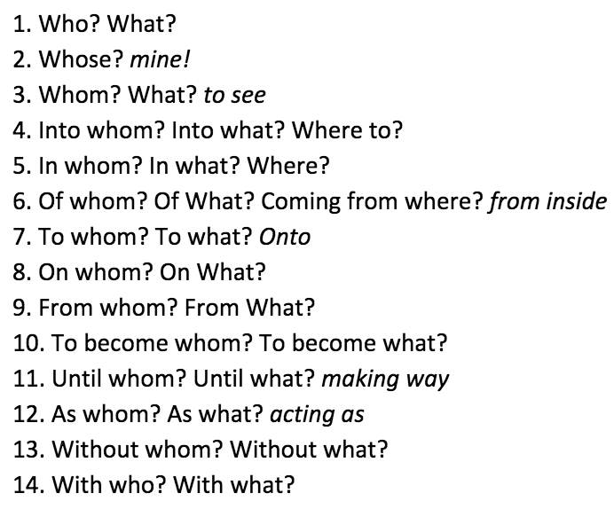

# Käänded

The 14 cases in Estonian language

---

---

---

### Which words can be modified with cases?

- Nouns = nimisõnad
- Adjactives = omadussõnad
- Numbers = arvsõnad
- Pronouns = asesõnad

---

---

# Küsisõnad

Words used in questions

---

- kes   =   who
- mis   =   what
- kus   =   where
- miks  =   why
- kas   =   if, whether
- kuidas=   how
- kui palju = how many
- kas, miks, mitmes, mitu, kui palju
